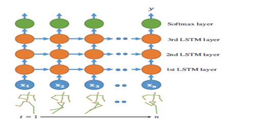

# LSTM for Action Recognition

## Description

This script takes the 3D skeleton as input and trains a 3-layer LSTM.
Two models of LSTMs are defined in the model.py script (You can use any one of them).
For demo - the location of pre-processed 3D skeleton files are mentioned in the lstm_train.sh
script. You can change this location for processing it on your dataset.
For other dataset, you also need to change the dataloaders.

## REQUIRED PACKAGES AND DEPENDENCIES

* python 3.6.8
* Tensorflow 1.13.0 (GPU compatible)
* keras 2.3.1
* Cuda 10.0
* CuDNN 7.4

## Execution

Example- 
sh lstm_train.sh 

Input parameters are provided in options.py
By default the parameters are defined for Toyota Smarthome
The skeletons are LCRNet output files transformed into numpy arrays.

The script will generate a weight directory in the name of the experiment, where the models will be saved after every epoch.
It will also  generate a csv file with the training details. The best model should be used for testing using the evaluation_model.py
script.

Enjoy AR with LSTM!!!

## Reference
<a id="1">[1]</a>
S. Das, M. Koperski, F. Bremond and G. Francesca. Deep-Temporal LSTM for Daily Living Action Recognition. In Proceedings of the 14th IEEE International Conference on Advanced Video and Signal-Based Surveillance, AVSS 2018, in Auckland, New Zealand, 27-30 November 2018.

